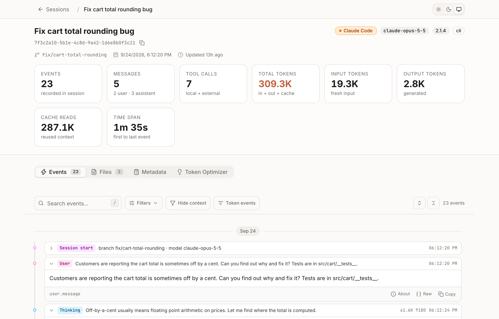
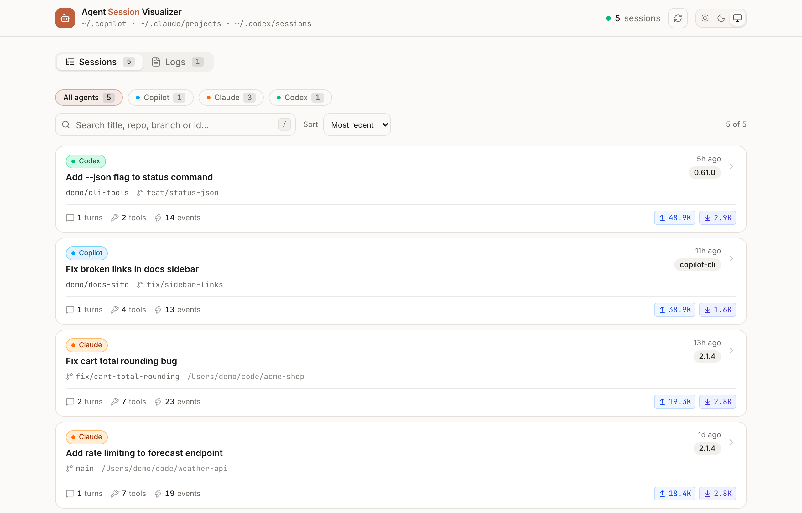
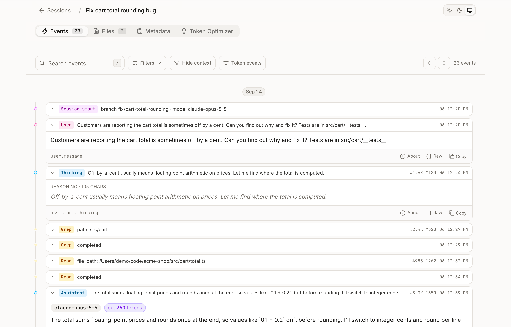
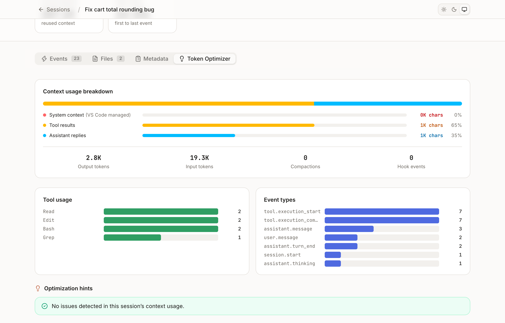

# Agent Session Visualizer

A local web UI for reading agent CLI transcripts: what the agent did, how long it
took, and where the tokens went. It reads the on-disk session files directly and
never sends them anywhere.

<picture>
  <source media="(prefers-color-scheme: dark)" srcset="docs/screenshots/session-overview-dark.png">
  
</picture>

## Screenshots

**All sessions in one place.** Every Copilot, Claude Code and Codex session on
the machine, filterable by agent and searchable by title, repo, branch or id.
Each card shows turns, tool calls and tokens in/out at a glance.

<picture>
  <source media="(prefers-color-scheme: dark)" srcset="docs/screenshots/sessions-dark.png">
  
</picture>

**Step-by-step timeline.** Prompts, reasoning, tool calls and their results in
order, with per-step token counts. Expand any event to see its content, or open
the raw record.



**Token Optimizer.** Where the context went (system prompt vs. tool results vs.
replies), which tools ran most, and hints for trimming expensive sessions.



> Screenshots use synthetic demo data. To reproduce them locally, see
> [Demo data](#demo-data).

Supported agents:

| Agent               | Reads from                                       | Session titles       | Logs |
| ------------------- | ------------------------------------------------ | -------------------- | ---- |
| GitHub Copilot CLI  | `~/.copilot/session-state`, `~/.copilot/logs`     | checkpoint DB        | yes  |
| Claude Code         | `~/.claude/projects/<project>/<session>.jsonl`    | `custom`/`ai` titles | no   |
| OpenAI Codex CLI    | `~/.codex/sessions/YYYY/MM/DD/rollout-*.jsonl`    | `session_index.jsonl`| no   |

Whichever directories exist on the machine show up; the rest are hidden.

## Getting started

```bash
pnpm install
pnpm dev
```

Open [http://localhost:3000](http://localhost:3000).

To run it in Docker with the transcript directories mounted read-only:

```bash
pnpm deploy:docker
```

### Demo data

To try the UI without your own transcripts (or to retake the screenshots),
generate a fake home directory with a few synthetic sessions and point the app
at it:

```bash
node scripts/demo-data.mjs /tmp/asv-demo
HOME=/tmp/asv-demo pnpm dev
```

## How it works

Every agent writes a different transcript format, so the app normalizes them into
one canonical event vocabulary and the UI only ever sees that.

```
src/lib/providers/
  types.ts      canonical model: SessionMeta, AgentEvent, SessionDetail, SessionProvider
  analysis.ts   provider-agnostic stats + token-cost hints
  fs-utils.ts   jsonl reading, directory walking, mtime-keyed caching
  copilot.ts    ~/.copilot adapter
  claude.ts     ~/.claude adapter
  codex.ts      ~/.codex adapter
  index.ts      registry: listSessions / getSession / listLogs across providers
```

Events are typed `category.subCategory` — `user.message`, `assistant.message`,
`assistant.thinking`, `tool.execution_start`, `tool.execution_complete`,
`external_tool.requested`, `context.attachment`, `file.patch_applied`,
`web.search`, `session.*`. Anything an adapter emits outside that list still
renders through a generic card, so a new record type is never a crash.

Token accounting is centralized: adapters put per-message usage on the event
(`inputTokens` / `outputTokens` / `cacheReadTokens`) or, when a provider reports
running totals, attach `data.sessionTotals`. The latest `sessionTotals` wins over
summation.

### Adding a provider

1. Write `src/lib/providers/<name>.ts` exporting a `SessionProvider`: `info`,
   `isAvailable`, `listSessions`, `getSession`, plus `listLogs`/`getLogContent`
   (return empty when the agent has no log directory).
2. Map its records onto the canonical event types; cap huge payloads before they
   reach the client, and set `resultChars` on tool results so the token review
   can size them.
3. Register it in `src/lib/providers/index.ts` and add its id to
   `ProviderId` in `types.ts`.
4. Add its badge colours to `src/lib/provider-meta.ts`.

Routes are provider-scoped: `/sessions/<provider>/<id>` and
`/api/sessions/<provider>/<id>`.
